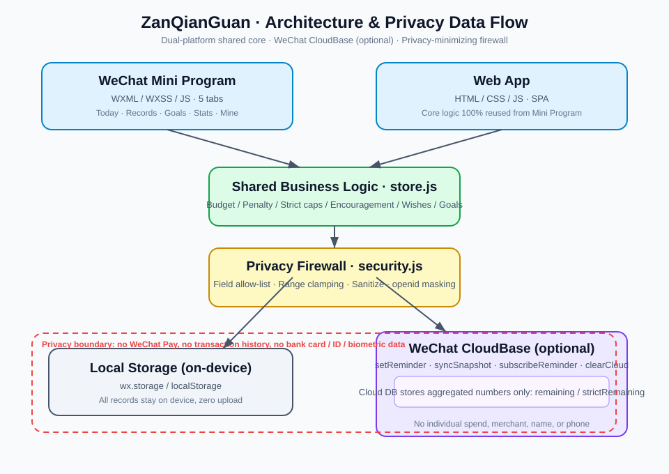

# ZanQianGuan · Daily Budget & Savings App

> A **privacy-first** daily budgeting and savings app. Overspending is auto-blocked with a penalty; impulse categories (milk tea / fried chicken / games) have strict daily caps; wishes unlock with a confetti animation when fully saved. Ships as both a WeChat Mini Program and a web app sharing the same core.

[](./README.md)
[](./攒钱罐/SECURITY.md)
[](https://putao-dun.vercel.app)

---

> **📌 Resume blurb**: Designed and built a privacy-first daily budgeting & savings app from scratch. A single shared business-logic module powers both a WeChat Mini Program and a web app. Implemented full interactions—overspend blocking, strict impulse-category caps, wish-unlock confetti—and a privacy firewall with field allow-lists and log masking, verified by Puppeteer screenshots and jsdom end-to-end tests.

## What this project demonstrates

- **One core, two platforms** — a single business-logic module (`store.js`) powers both the WeChat Mini Program and the web app; only the UI differs (WXML vs. HTML). Shows abstraction and code reuse.
- **Solid front-end engineering** — vanilla HTML / CSS / ES6 SPA + WeChat Mini Program, no framework bloat; readable, testable, controllable code.
- **Privacy-first security** — no payment integration, field allow-lists, server-side validation, log masking, one-click cloud wipe. Demonstrates compliance and security awareness.
- **Automated verification** — Puppeteer screenshots + jsdom end-to-end tests prove the app actually runs, not just compiles.
- **Polished UX details** — spend blocking, penalty mechanics, daily encouragement, wish-unlock confetti.

## Tech Stack

- **Frontend**: vanilla HTML5 / CSS3 / ES6 (SPA, zero framework deps)
- **State**: custom `store.js`, localStorage persistence
- **WeChat Mini Program**: WXML / WXSS / JS + WeChat CloudBase (subscribe-message cloud-function templates)
- **Security**: custom `security.js` (field allow-list / range clamping / text sanitizing / openid masking)
- **Testing**: Puppeteer screenshot automation + jsdom E2E

## Project Structure

```
.
├─ 攒钱罐-web/   # Web app (pure frontend, open index.html to run)
├─ 攒钱罐/       # WeChat Mini Program + CloudBase cloud-function templates
└─ README.md / README.en.md
```

## Features

- Daily "available amount" setting with real-time remaining balance
- Overspend auto-block + penalty transferred to the piggy bank
- **Strict daily caps on impulse categories** (milk tea / fried chicken / games)
- Daily savings encouragement + piggy-bank accumulation
- 52-week / 365-day / custom savings goals
- Wish list: auto-unlock + confetti when affordable
- Category breakdown, 7-day trend, penalty history
- JSON export / import backup

## Security & Privacy

- **No WeChat Pay integration**, never reads transaction history
- Cloud stores only aggregated numbers (remaining balance), never individual spends / merchants / notes
- Field allow-list, range clamping, text sanitizing, openid masking
- One-click cloud wipe and a fully local mode

Full security notes: [SECURITY.md](./攒钱罐/SECURITY.md)

## Screenshots

Web app gallery (Chinese UI): [攒钱罐-web/screenshots](./攒钱罐-web/screenshots)

## Architecture



One shared business-logic layer drives both clients; only aggregated numbers ever reach the cloud, and every record stays on-device.

## Quick Start

```bash
# Web: just open 攒钱罐-web/index.html, or serve locally
cd 攒钱罐-web && python3 -m http.server 8080
# Mini Program: import the 攒钱罐/ folder into WeChat DevTools
```

---

## License

Copyright © 2026 Chen Ruijie. Free to view and share with attribution for learning / portfolio use. **Commercial use is prohibited.** See [LICENSE](./LICENSE).

---

Made with 🐷 by WorkBuddy
