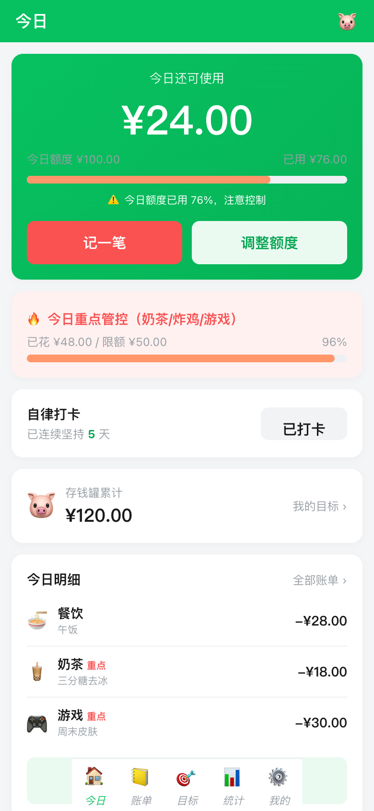
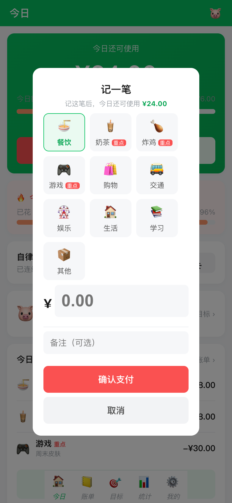
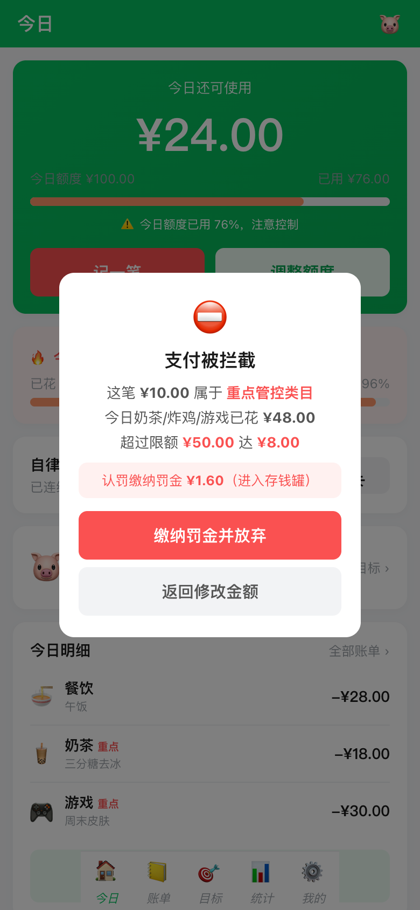
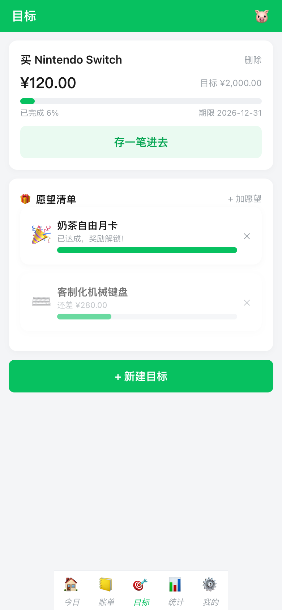
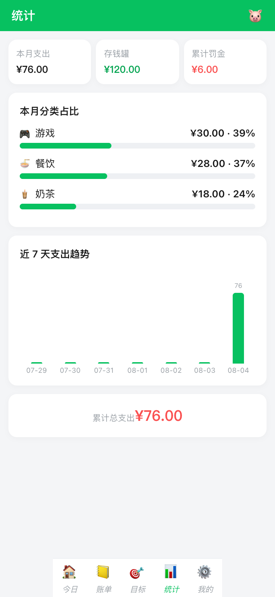
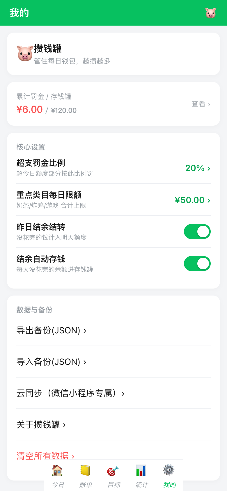
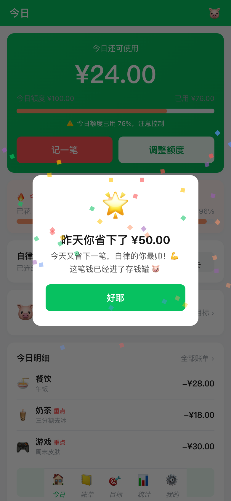
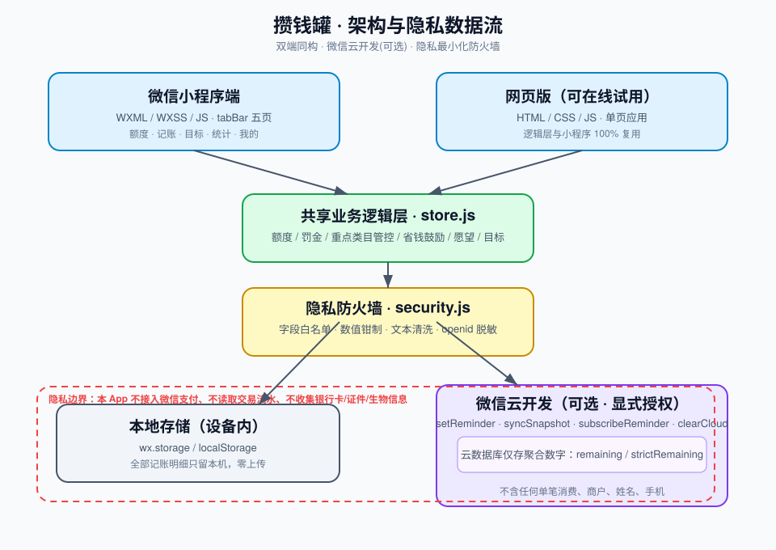

# 攒钱罐 · 网页版

> 一个**隐私优先**的每日预算与存钱打卡工具。花超自动拦截并罚金，奶茶/炸鸡/游戏重点管控，愿望达成撒花解锁。

[](../README.md#微信小程序版)
[](#安全与隐私设计)

## 30 秒看懂

每天设定「今日可用金额」，每一笔支出都会扣减余额。花超了？**支付会被直接拦截**，并按罚金比例把钱扣进「存钱罐」。针对奶茶/炸鸡/游戏三类冲动消费，还有独立的**重点类目限额**。

没花完的余额可以自动转入存钱罐，第二天打开会收到省钱鼓励；存够了就能解锁愿望清单，触发撒花动画 🎉。

网页版功能与微信小程序版完全一致，双击 `index.html` 即可离线运行，数据只存浏览器本地。

## 截图

<table>
  <tr>
    <td></td>
    <td></td>
    <td></td>
    <td></td>
  </tr>
  <tr>
    <td align="center">今日首页与重点管控</td>
    <td align="center">记一笔</td>
    <td align="center">重点类目超支拦截</td>
    <td align="center">存钱目标 + 愿望清单</td>
  </tr>
  <tr>
    <td></td>
    <td></td>
    <td></td>
    <td></td>
  </tr>
  <tr>
    <td align="center">分类占比与趋势</td>
    <td align="center">核心设置与备份</td>
    <td align="center">每日省钱鼓励弹窗</td>
    <td></td>
  </tr>
</table>

## 核心亮点

| 亮点 | 说明 |
|------|------|
| **双端同构** | 业务逻辑 `store.js` 在小程序与网页版之间完全复用，UI 分别用 WXML 与 HTML 实现。 |
| **支付拦截 + 罚金** | 超支时不是简单提示，而是阻断支付并罚没一定比例到存钱罐，形成真约束。 |
| **重点类目管控** | 奶茶/炸鸡/游戏三类合计每日限额，单独拦截、单独罚金，解决冲动消费。 |
| **鼓励反馈** | 当天剩余自动转入存钱罐，次日打开弹出鼓励语；随时可点「今日小结」。 |
| **愿望解锁动画** | 存钱罐金额达到愿望成本后，自动解锁并播放撒花特效，提供正向激励。 |
| **隐私优先** | 网页版不上传任何数据；小程序版上传云端时也仅传「聚合数字」，不碰支付/姓名/手机。 |

## 技术栈

- **前端**：原生 HTML5 / CSS3 / ES6（单页应用，无框架依赖）
- **状态管理**：自研 `store.js`，localStorage 持久化
- **测试**：Puppeteer 截图 + jsdom 端到端测试
- **微信小程序**：WXML / WXSS / JS + 微信云开发（订阅消息云函数模板）
- **安全**：自研 `security.js` 字段白名单 / 数值钳制 / 文本清洗 / openid 脱敏

## 架构图



双端复用同一套业务逻辑层；发往云端的只有聚合后的剩余额度，所有记账明细均留在设备本地。

## 安全与隐私设计

本项目为记账/预算工具，**不接入微信支付、不读取交易流水、不收集银行卡/姓名/手机号**。具体防护：

- **字段白名单**：客户端与云端都只接受声明过的字段，未知字段直接拒绝。
- **数值钳制**：金额/时间等全部限制在合理范围，防止异常数据污染。
- **服务端校验**：云函数忽略客户端传入的 openid，仅从 `wxContext` 获取。
- **日志脱敏**：日志中 openid 只保留前 4 位，不打印任何用户明细。
- **一键清除**：「我的」页提供「清除云端数据」入口。
- **本地模式**：不配置云环境时所有云端能力自动关闭，数据零外传。

完整安全说明见小程序版 [`SECURITY.md`](../攒钱罐/SECURITY.md)。

## 本地运行

```bash
cd 攒钱罐-web
# 方式一：直接双击打开 index.html
# 方式二：启动本地服务
python3 -m http.server 8080
# 浏览器打开 http://localhost:8080
```

## 部署到线上（可选 · 永久可访问）

本目录是纯静态站点，可一键部署到免费静态托管，获得长期有效的在线 Demo 链接：

- **Vercel 已部署**：https://putao-joq8-pe7acbjf3-putao1.vercel.app（仓库根目录 `vercel.json` 已配置发布目录为 `攒钱罐-web`，导入后无需构建即可上线）
- **Netlify**：仓库根目录 `netlify.toml` 已配置发布目录为 `攒钱罐-web`，导入后无需构建即可得到 `*.netlify.app` 永久链接。
- 也可直接用 **GitHub Pages**（将本目录内容放到仓库根或 `/docs` 后开启 Pages）。

## 微信小程序版

同构的小程序代码在 [`../攒钱罐`](../攒钱罐) 目录，已实现：

- 完整界面与交互（WXML/WXSS/JS）
- 订阅消息云函数模板（`setReminder` / `syncSnapshot` / `subscribeReminder` / `clearCloud`）
- 隐私防火墙 `utils/security.js`

接入微信云开发后，可启用多设备同步与每日剩余额度定时推送。

## 后续可扩展

- [ ] 微信小程序上线并启用云同步
- [ ] 预算超支实时订阅消息（目前为每日定时推送）
- [ ] 月度/年度账单导出 PDF
- [ ] 家庭成员共享预算（需更多隐私设计）

---

Made with 🐷 by WorkBuddy
